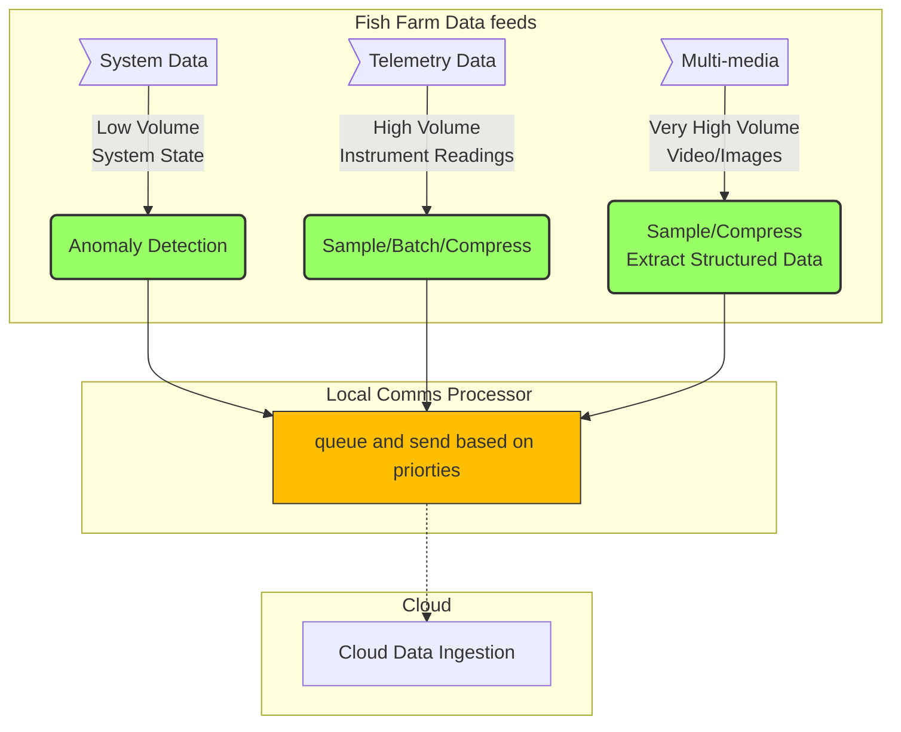

# ADR001 - Use of Edge Computing To Process Data Locally
## Status
Accepted
## Context
The devices providing telemetry and video data for the Fishy Watch system are operating in globally distributed locations. A fish farm may be within the confines of a lake or somewhere out to sea and be exposed to the forces of nature. These environments are likely to be challenging and loss of internet connectivity is to be expected from time to time. 
## Decision
To help mitigate the affects of Wide Area Network (WAN) connection losses, it it proposed that we employ data processing units at 'the edge', alongside the sensors and cameras that are capturing the data for Fishy Watch. These units would process the System, Telemetry and Multi-media data from the devices to perform useful tasks, such as:
   - batching and compression of telemetry data to reduce consumed bandwidth when sending to the cloud.
   - identification of threshold breaches for pH etc. and the creation of the associated alarms.
   - structured data extraction from video and image data that can be sent independently of the bandwidth hungry multi-media data if necessary.
   - apply QoS metrics to the various data so that priority information such as alerts, are always sent ahead of less critical data, once connectivity is reestablished.
The following schematic illustrates the concept of what we are aiming for:

## Consequences
Processing data locally (at the farm) will entail deploying additional devices alongside those used for monitoring. These will need to be hardened to cope with the conditions and be able to run on relatively low power. This will add additional hardware costs to the project but should increase the reliability and usefulness of the system, especially in the face of intermittent WAN downtime.
