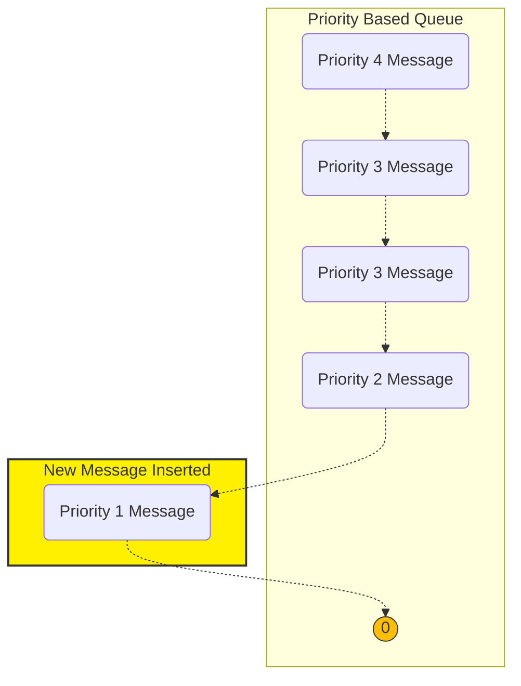

# ADR002 - Use a Priority Queue for Messaging

## Status

proposed

## Context

The Fish Watch system operates in challenging environments as discussed in 001_ADR_Edge_Computing. These conditions may lead to WAN downtime and messages being lost unless some provision is made to store them locally until they can be sent once connectivity is re-established.
The messages being sent from the system may be of various times and of varying priority. E.G. Alerts related to anomalous pH or oxygen levels may be considered more important than responses to image requests. If a large number of messages have be cached locally awaiting WAN connectivity it is desirable to prioritize the sending of the Alerts over the upload of images. In addition to being of higher priority, it is expected that alerts will be smaller in terms of message length than, say, an image upload and so may get 'drowned out' by these larger messages if no compensating steps are taken.   

## Decision

The decision is to use the [Priority Queue Pattern](https://learn.microsoft.com/en-us/azure/architecture/patterns/priority-queue) to allow high priority messages, such as alerts about potential hazards, to be uploaded before lower priority messages so that the farmers can react in as timely a manner as possible. 

## Consequences

Re-ordering the message queues based on the priority of incoming messages, ensuring those of highest priority are sent first, will help ensure that the most important and time critical information is sent to the farmers first.
It is important to choose the priority levels carefully, however, so that lower priority messages do, eventually, get sent and are not 'blocked' by a continuous stream of messages that are only slightly more important.
This approach may still lead, however,  to lower priority messages being delayed indefinitely or to a point where they are no longer relevant, in which case, some way to purge them from the queue may be required to prevent them 'clogging' the message queue.