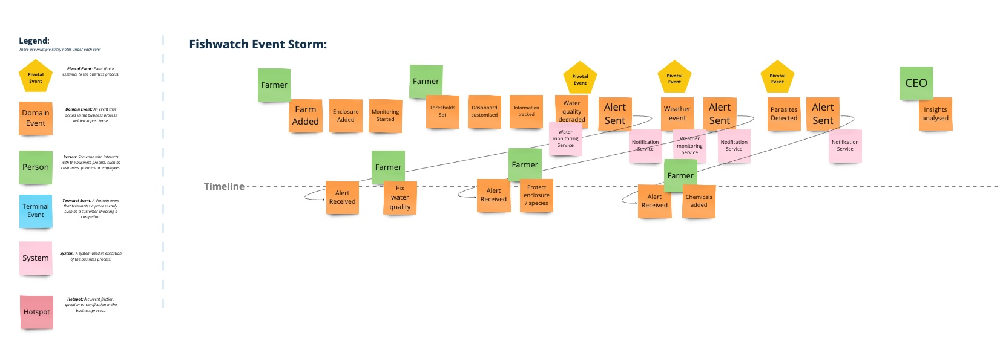
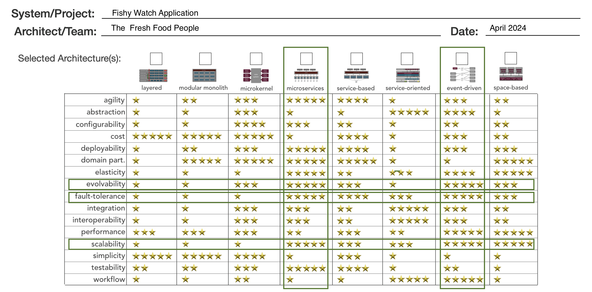

# Fishy Watch Application 
## Overview
The Fishwatch application works as a single integrated platform for overall fish farm maintenance including water quality monitoring, weather monitoring & fish health monitoring.
## Functional Requirements
- Farmers need to see the collected information in dashboards that they can customize.
- They also need to be able to specify thresholds at which alerts should be triggered this could be simple things like a PH going out of bounds, but could also involve
advanced warnings of adverse weather events that are expected.
- Farmers track information about the fish harvested from each farm and this information together with the raw data being collected should be used to build a model of what factors produce good harvests.
- For large customers, they will want to be able to drive insights across a number of farms.
- It’s vital that alerts be generated in a timely manner - a sharp degradation in water quality or adverse weather events could have massive implications if the farmer doesn’t have enough warning.

## Non Functional Requirements
- Performance: Ensure the system processes data and triggers alerts in real-time to prevent potential losses. Maintain high responsiveness in dashboard interactions and data visualization.
- Scalability: Design to efficiently handle data from a few to over a million fish across multiple farms and enclosures. Scale dynamically as new farms, enclosures, and devices are added.
- Reliability: Achieve high availability, especially for the alerting mechanisms and real-time data feeds.
- Security: Implement strong security measures to protect sensitive data about farms and livestock.
- Extendibility: Design the system to easily integrate with other types of livestock monitoring in the future.

## Assumptions
- Each enclosure will only have one type of fish species.
- Fish behaviour and water quality etc will become richer over time as we are able to deploy more powerful devices

## Constraints
- Farms might have weak cellular signals
- Rugged industrial devices can be used by farmers during harvest

## Event Storming
We used an Event Storming session to kick start the ideation of these ideas. The results of this are shown in Fig. 1 below.

**
Fig.1 - Fishy Watch Event Storming
**

## Architecture Style
We used the Event-driven and Microservices architecture for the Fishy Watch application to achieve scalability, fault-tolerance, and evolvability.

**
Fig.2 - Fishy Watch Architecture Style
**

## Key Decisions
Below are some of the architecture decisions we made for the Fishy Watch system.
- [Edge Computing](ADR/001_ADR_Edge_Computing.md)
- [Priority Queue Pattern](ADR/002_ADR_Priority_Queue.md)
- [Polyglot Persistence](ADR/003_ADR_Database.md)
- [GraphQL Federation](ADR/004_ADR_GraphQL%20Federation.md)

## Architecture Diagrams
The following sections show the architectural system context diagram, container diagram and component diagrams of the Fishy Watch system.

## Context Diagram

**
Fig. 3 - Fishy Watch Architecture
**

## Components Diagrams

### Data Processing

**
Fig. 4 - Fishy Watch Data Processing
**

### Database

**
Fig. 5 - Fishy Watch Data Persistence
**

### Application API (Service Composition/GraphQL/Backend For Frontend)

**
Fig. 6 - Fishy Watch Service Composition for UI
**
