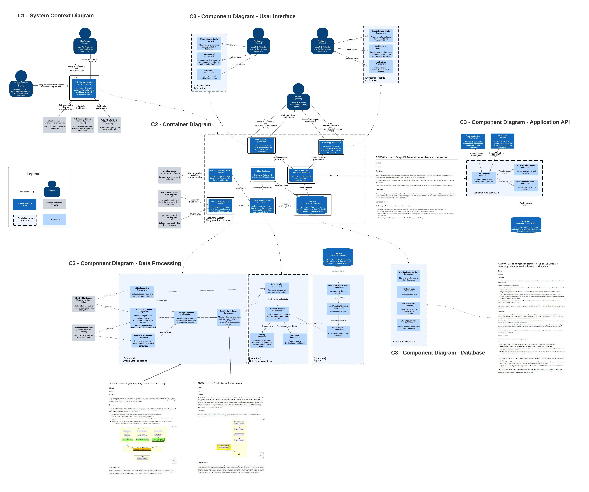
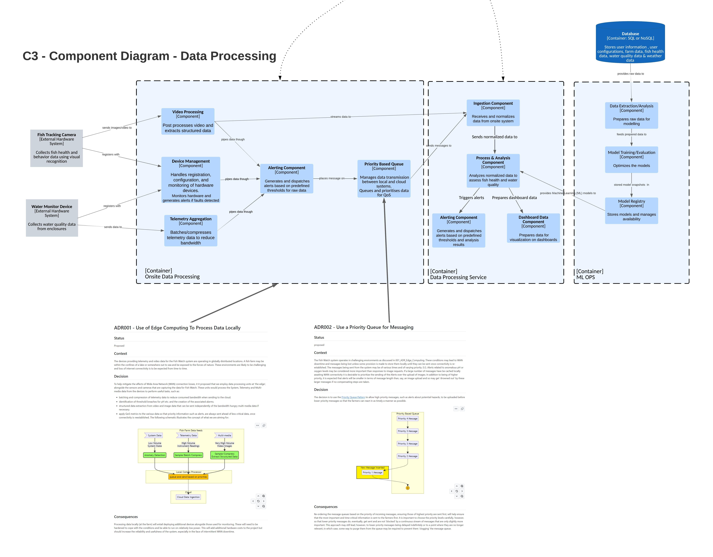
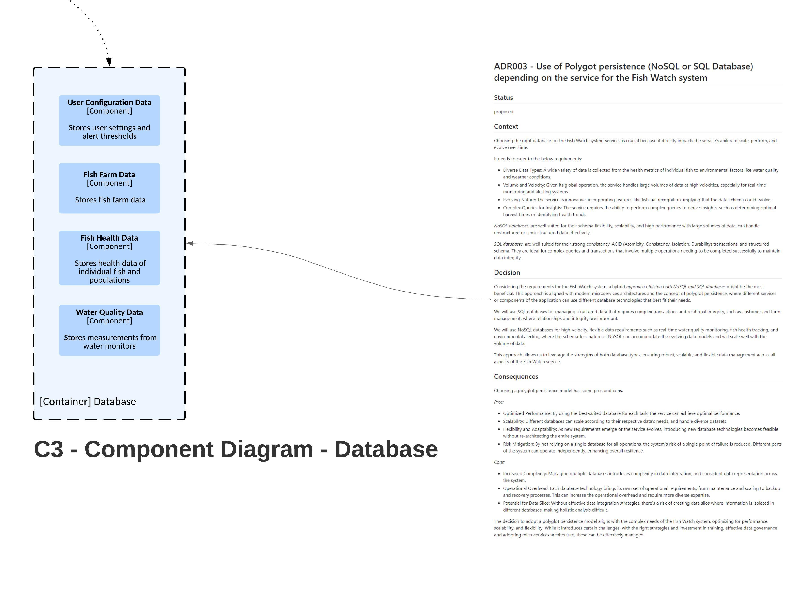
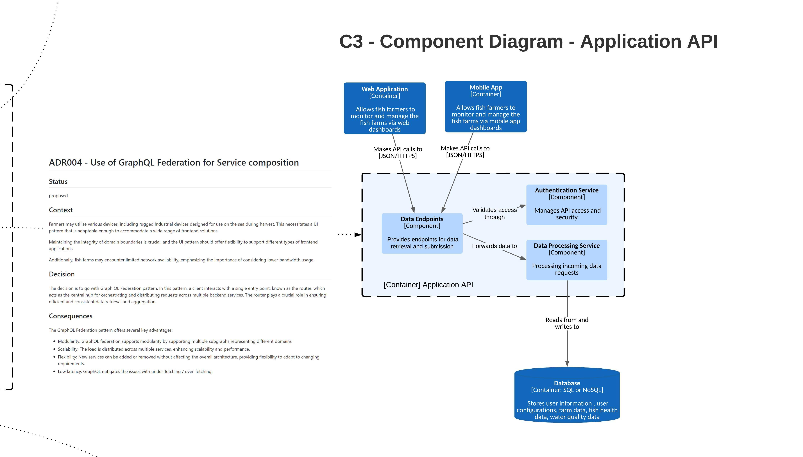

# Fishy Watch Application 
## Overview
The Fishwatch application works as a single integrated platform for overall fish farm maintenance including water quality monitoring, weather monitoring & fish health monitoring.
## Functional Requirements
- Farmers need to see the collected information in dashboards that they can customize.
- They also need to be able to specify thresholds at which alerts should be triggered this could be simple things like a PH going out of bounds, but could also involve
advanced warnings of adverse weather events that are expected.
- Farmers track information about the fish harvested from each farm and this information together with the raw data being collected should be used to build a model of what factors produce good harvests.
- For large customers, they will want to be able to drive insights across a number of farms.
- It’s vital that alerts be generated in a timely manner - a sharp degradation in water quality or adverse weather events could have massive implications if the farmer doesn’t have enough warning.

## Assumptions
- Each enclosure will only have one type of fish species.
- Fish behaviour and water quality etc will become richer over time as we are able to deploy more powerful devices

## Constraints
- Farms might have weak cellular signals
- Rugged industrial devices can be used by farmers during harvest

## Key Decisions
- [Edge Computing](ADR/001_ADR_Edge_Computing.md)
- [Priority Queue Pattern](ADR/002_ADR_Priority_Queue.md)
- [Polyglot Persistence](ADR/003_ADR_Database.md)
- [GraphQL Federation](ADR/004_ADR_GraphQL%20Federation.md)

## Context Diagram

**
Fig. 1 - Fishy Watch Architecture
**

## Components Diagram

### Data Processing

**
Fig. 2 - Fishy Watch Data Processing
**

### Database

**
Fig. 3 - Fishy Watch Data Persistence
**

### Application API (Service Composition/GraphQL/Backend For Frontend)

**
Fig. 4 - Fishy Watch Service Composition for UI
**