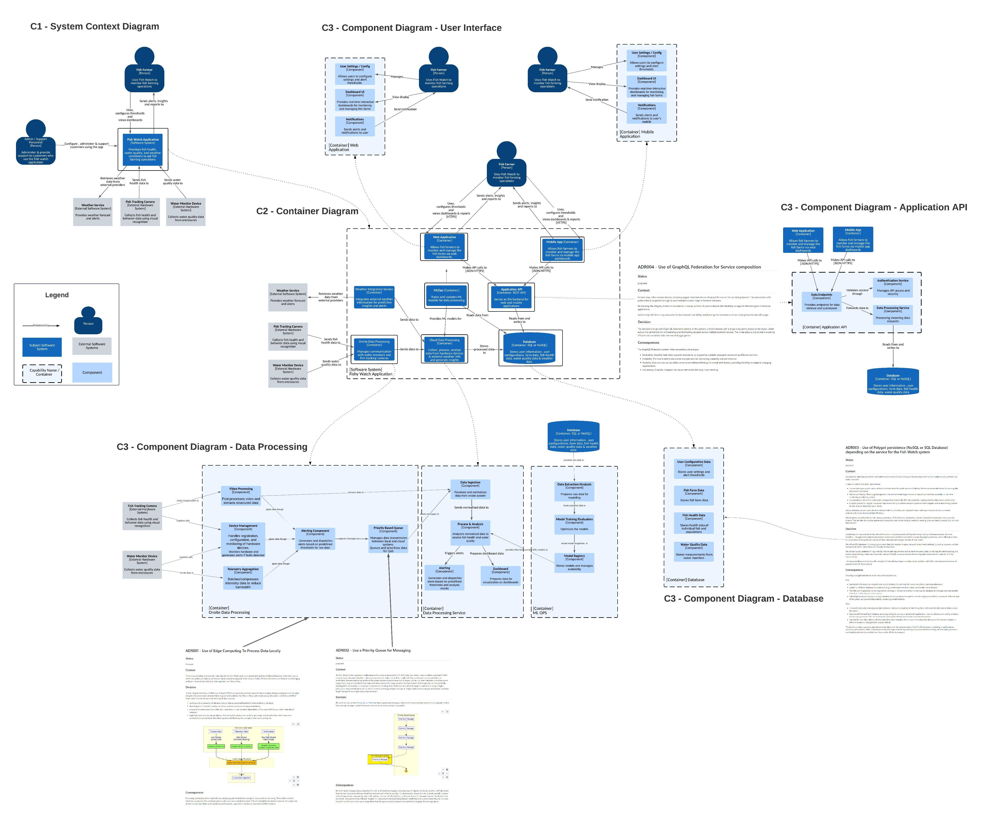

# O'Reilly Architectural Katas - Fishy Watch

## The Team

Hi!, We are the Fresh Food People. A group of Solution Architects from WooliesX, the Tech arm of Woolworths Australia. Our humble little band is made up of:

 - [Meena Kasi](https://www.linkedin.com/in/meenakasi/): Focused on the *Singular Customer View* capabilities within our  **Personalisation and Media Domain**
 - [Ranjeet Singh](https://www.linkedin.com/in/rsinghyadav/): Focused on the *Customer Comms - Targeted & Personalised* capabilities within our **Personalisation and Media Domain**
 - [Dhaval Kamdar](https://www.linkedin.com/in/dkamdar/): Focused on the *Insurance & Telco* capabilities within out **Everyday Domain**
 - [Kannan Avadaiappan](https://www.linkedin.com/in/avakannan/) :
 - [Spencer Nesbitt](https://www.linkedin.com/in/spencer-nesbitt-3024684/) - Focused on the *Capacity and Demand Management* capabilities within our **Fulfillment Domain**.  

## The Task
The task is to come up with a solution architecture for Fishy Watch, a system that will help farmers manage their fish stocks. The scenario is based on the Livestock Insights Incorporated company, headquartered in Scotland, but operating globally Their main service offering, Fishy Watch, is used by Fish Farmers around the world to monitor their fish, and the fish farms in general It is able to collect information about individual fish, water quality, and weather information Fish farmers use this information to understand the health of their livestock, check for signs of parasites and disease, and work out the best time to harvest
The context, constraints and requirements are:

 - Each customer of Fish Watch may operate a number of fish farms in different geographical locations. Some customers might have a single farm, but the biggest clients have over a hundred. 
 - Each farm is split into different enclosures where the fish are kept. A small farm might have as few as ten enclosures, large farms may have a thousand or more. The biggest farms might have over a million fish. 
 - There are water monitors in each enclosure which capture water quality information including PH, temperature, salinity, oxygen levels and other factors 
 - Underwater cameras are positioned in each enclosure which can get a general view of fish health, looking at size, activity, and whether parasites are detected 
 - A beta feature is live where individual fish can be identified via fish-ual recognition, to monitor the health and lifecycle of an individual fish

## The Tools

We are fortunate to have access to some excellent collaboration tools within the WooliesX environment that help us work together to brainstorm, ideate and crystalize a solution to this challenge. Specifically we have used [Miro](https://miro.com/) to run a virtual [Event Storming](https://www.eventstorming.com/) session and develop a [Bounded Context](https://github.com/ddd-crew/bounded-context-canvas) view of the system. We also used  [Lucid Chart](https://www.lucidchart.com/pages/) to produce our [C4](https://c4model.com/) diagrams. 

## System Architecture

The diagram below shows the system C4 context and associated component diagrams for our proposed architecture. Please refer to [this architecture discussion](./Architecture.md) for details of how we arrived at this.

The following diagrams show the Context areas along with the Architectural Design Records (ADRs) for the key decisions we made along the way.