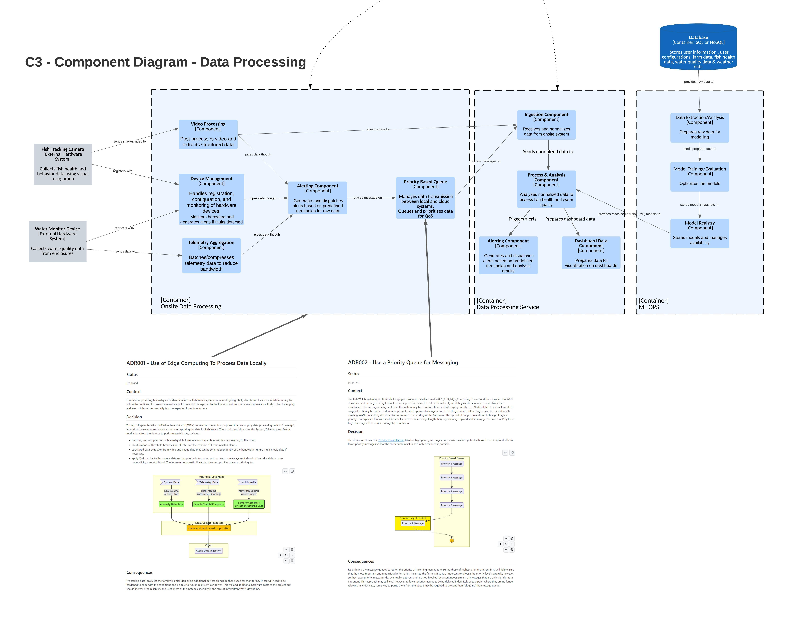

# O'Reilly Architectural Katas - Fishy Watch

## The Team

Hi!, We are the Fresh Food People. A group of Solution Architects from WooliesX, the Tech arm of Woolworths Australia. Our humble little band is made up of:

 - [Meena Kasi](https://www.linkedin.com/in/meenakasi/): Focused on the *Single Customer View* capabilities within our  **Personalisation and Media Domain**
 - [Ranjeet Singh](https://www.linkedin.com/in/rsinghyadav/): Focused on the *Customer Comms - Targeted & Personalised* capabilities within our **Personalisation and Media Domain**
 - [Dhaval Kamdar](https://www.linkedin.com/in/dkamdar/): Focused on the *Insurance & Telco* capabilities within our **Everyday Domain**
 - [Kannan Avadaiappan](https://www.linkedin.com/in/avakannan/) : Focused on the *Product Data and Experience* capabilities within our **Plan & Shop Domain**
 - [Spencer Nesbitt](https://www.linkedin.com/in/spencer-nesbitt-3024684/) - Focused on the *Capacity and Demand Management* capabilities within our **Fulfillment Domain**.  

## The Task
The task is to come up with a solution architecture for Fishy Watch, a system that will help farmers manage their fish stocks. The scenario is based on the Livestock Insights Incorporated company, headquartered in Scotland, but operating globally Their main service offering, Fishy Watch, is used by Fish Farmers around the world to monitor their fish, and the fish farms in general It is able to collect information about individual fish, water quality, and weather information Fish farmers use this information to understand the health of their livestock, check for signs of parasites and disease, and work out the best time to harvest
The context, constraints and requirements are:

 - Each customer of Fish Watch may operate a number of fish farms in different geographical locations. Some customers might have a single farm, but the biggest clients have over a hundred. 
 - Each farm is split into different enclosures where the fish are kept. A small farm might have as few as ten enclosures, large farms may have a thousand or more. The biggest farms might have over a million fish. 
 - There are water monitors in each enclosure which capture water quality information including PH, temperature, salinity, oxygen levels and other factors 
 - Underwater cameras are positioned in each enclosure which can get a general view of fish health, looking at size, activity, and whether parasites are detected 
 - A beta feature is live where individual fish can be identified via fish-ual recognition, to monitor the health and lifecycle of an individual fish

## The Tools

We are fortunate to have access to some excellent collaboration tools within the WooliesX environment that help us work together to brainstorm, ideate and crystalize a solution to this challenge. Specifically we have used [Miro](https://miro.com/) to run a virtual [Event Storming](https://www.eventstorming.com/) session and develop a [Bounded Context](https://github.com/ddd-crew/bounded-context-canvas) view of the system. We also used  [Lucid Chart](https://www.lucidchart.com/pages/) to produce our [C4](https://c4model.com/) diagrams. 

## System Architecture

The diagram below (Fig. 1.1 - Fishy Watch Architecture) shows the system C4 context and associated component diagrams for our proposed architecture. Please refer to [this architecture discussion](./Architecture.md) for details of how we arrived at this.

**
Fig. 1.1 - Fishy Watch Architecture
**
The following diagrams show the Context areas along with the Architectural Design Records (ADRs) for the key decisions we made along the way.

### Edge Computing for onsite data processing

The following ADRs relate to how we process data onsite prior to upload to the cloud:
- [Edge Computing](ADR/001_ADR_Edge_Computing.md)
- [Priority Queue Pattern](ADR/002_ADR_Priority_Queue.md)

Their association to the solution architecture is shown below (Fig. 1.2 - Fishy Watch Data Processing):

**
Fig. 1.2 - Fishy Watch Data Processing
**

This distributed approach to processing the data supports many uses cases, here are just a few:

#### [Detecting threshold breaches and creating high priority alerts.](Workflows/telemetry_reading_threshold_breach.md)

Farmers are interested when telemetry measurements (pH, temperature, salinity, oxygen levels etc.) go outside predefined bounds (thresholds). The thresholds are set by the farmers and may depend on location and the specifics of the geographical location of the farm.
The system will generate alerts when these readings are outside of the pre-defined thresholds (subject to a configurable 'debouncing' approach) and send these as high priority to the farmer (and other subscribers). 
The sequence is as follows:

1. Telemetry is recieved from a sensor (e.g. pH level).
2. The signal is 'debounced' to reduce noise (e.g. filter out duplicate or very similar readings within a given minute).
3. Check the reading against the configured threshold(s). E.g pH between 6.8 and 7.2.
4. Queue a high priority alert if the threshold is breached.

#### [Detection of a type of parasite previously not seen at the enclosure](Workflows/new_parasite_detection.md)

In order to support farmers with early warning of a potential new parasite infestation, a workflow will be put in place to send an alert when a new type of parasite is detected. 
The sequence is as follows:

1. Camera detects a parasite.
2. Check the parasite against those previously detected at the enclosure.
3. Queue a high priority alert if this is a new type of parasite for this enclosure.
4. If its an existing type, check the threshold for a parasite count of this type.
5. Queue a high priority alert if we have breached the detection limit.
6. Send this and any other alerts to the cloud based on their priority.

#### [Asynchronous image request](Workflows/asynchronous_image_request.md)

There are a number of reasons that a Fish Watch user (farmer, support engineer, etc.) may wish to obtain a still image or images from the underwater cameras. For example, a treatment for a particular parasite may have been administered and the user wishes to obtain some images of the fish to determine how effective the treatment was.
In the low bandwidth, patchy environments we expect Fish Watch to be deployed in, there may be times when a synchronous response to such a request is not possible. It may be also the case that we which to control the rate at which these types of requests are processed. To this end, we will provide an API that will allow image requests to me queued and processed asynchronously. 
The sequence is as follows:

1. User requests an image via the UI.
2. The Request is stored by the API in the local request queue and a 202 Accepted response returned.
3. The request is sent to the camera.
4. The camera captures the image.
5. The image is wrapped in a message and placed on the outgoing queue.
6. The message is sent to the cloud and made available to the user.
7. The user is notified of the image availability along with an access link.

### Polyglot Data Storage

The following ADRs relate to how we store operational data for the various Fishy Watch microservices:
- [Polyglot Persistance](ADR/003_ADR_Database.md)

Their association to the solution architecture is shown below (Fig. 1.3 - Fishy Watch Data Persistence):

**
Fig. 1.3 - Fishy Watch Data Persistence
**

### Application API (Service Composition/BFF/GraphQL)

The following ADRs relate to how we simplify UI interactions with the microservice APIs:
- [GraphQL for Service Composittion/Backend For Frontend (BFF)](ADR/004_ADR_GraphQL%20Federation.md)

**
Fig. 4 - Fishy Watch Service Composition for UI
**

## Bounded Contexts 

We have identified a number of bounded context within the Fishy Watch domain. An initial analysis suggests those shown in Fig 3 below:

**
Fig. 3 - Fishy Watch Bounded Context
**

A bounded context canvas for Farm Management is shown below in Fig 4.

**
Fig. 4 - Fishy Watch Farm Management Bounded Context Canvas 
**