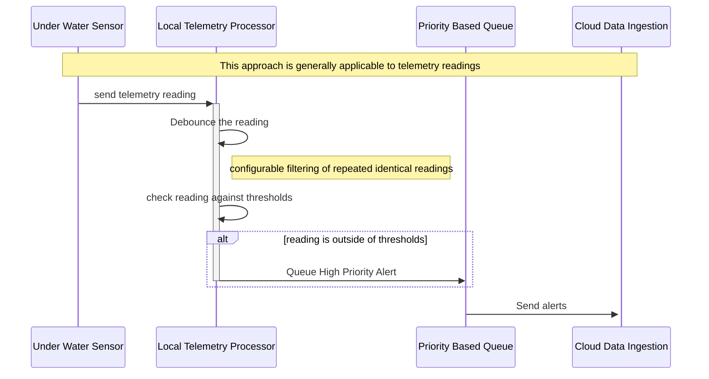

# Priority alerts for threshold breaches

## Context

Farmers are interested when telemetry measurements (pH, temperature, salinity, oxygen levels etc.) go outside predefined bounds (thresholds). The thresholds are set by the farmers and may depend on location and the specifics of the geographical location of the farm.
The system will generate alerts when these readings are outside of the pre-defined thresholds (subject to a configurable 'debouncing' approach) and send these as high priority to the farmer (and other subscribers).

## Sequence
1. Telemetry is recieved from a sensor (e.g. pH level).
2. The signal is 'debounced' to reduce noise (e.g. filter out duplicate or very similar readings within a given minute).
3. Check the reading against the configured threshold(s). E.g pH between 6.8 and 7.2.  
4. Queue a high priority alert if the threshold is breached.

